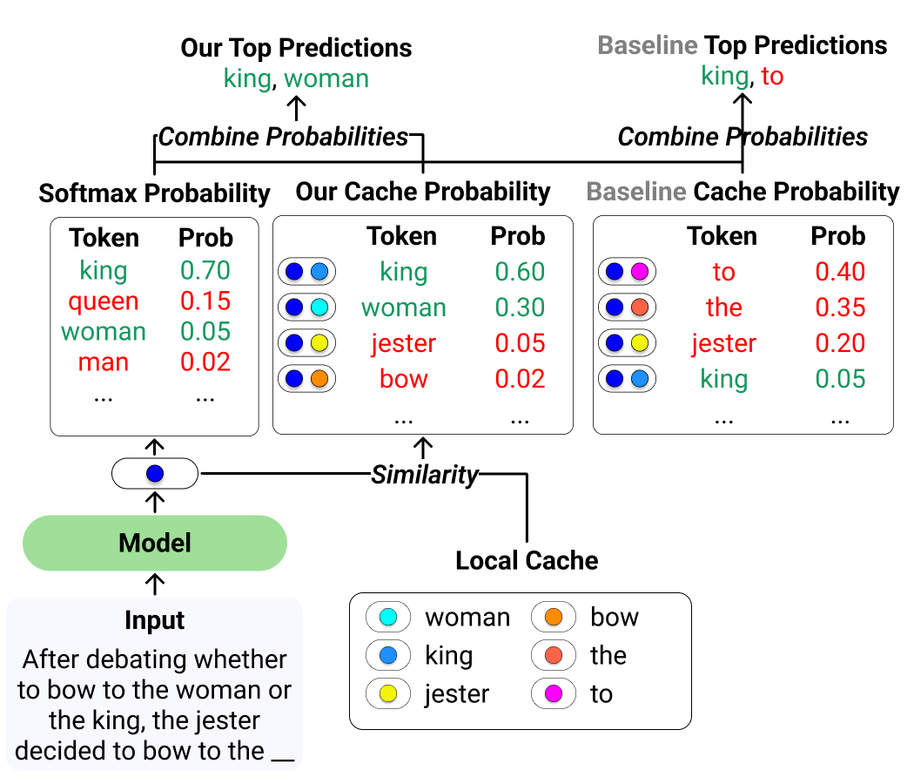
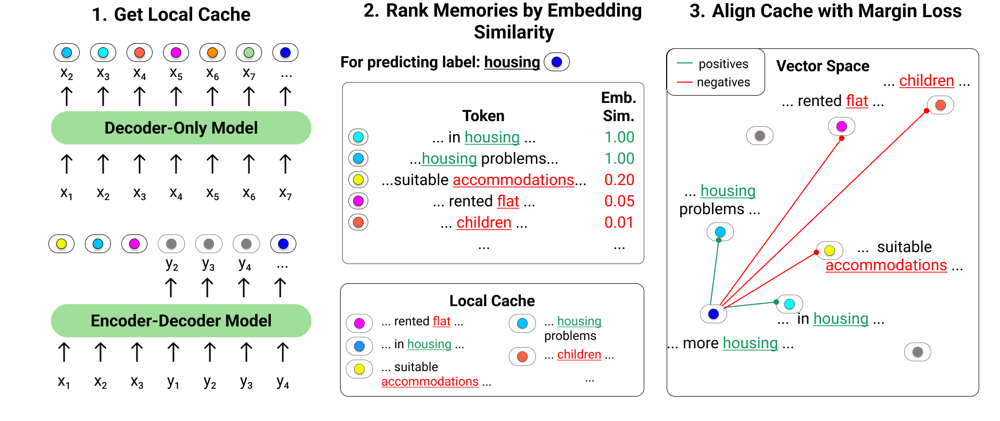

# HistAlign: Improving Context Dependency in Language Generation by Aligning with History

This repository contains the code for the paper "HistAlign: Improving Context Dependency in Language Generation by Aligning with History"

**Authors:** [David Wan](https://meetdavidwan.github.io), [Shiyue Zhang](https://www.cs.unc.edu/~shiyue/), and [Mohit Bansal](https://www.cs.unc.edu/~mbansal)

**Arxiv:** [https://arxiv.org/abs/2305.04782](https://arxiv.org/abs/2305.04782)

## Overview



We present HistAlign, a new training approach to ensure good cache alignment such that the model receives useful signals from the history. We demonstrate
that HistAlign improves text coherence and faithfulness in open-ended and conditional generation settings respectively.



Our proposed training method HistAlign is based on order-informed contrastive
learning, which alleviates the misalignment problem and makes better use of memories.


## 1. Preliminaries

### 1.1 Requirements
Needed packages:
- PyTorch
- [transformers](https://github.com/huggingface/transformers) >= 4.26.1
- [datasets](https://github.com/huggingface/datasets) >=2.10.1
- [torch-scatter](https://github.com/rusty1s/pytorch_scatter)
- [deepspeed](https://github.com/microsoft/DeepSpeed) == 0.8.0

### 1.2 Code
The code for all tasks are all adatped and modified from the correpsonding Huggingface's examples code. For training, the added parameters are `--model_type [orig,trime,histalign]`. For HistAlign, we can optionally specify `--contrastive_weight 1.0 --margin 0.001`.

The primary addition are the models which can be found in `src/modeling`.

## 2. Ambiguous Template
1. Dataset can be created from `scripts/create_ambiguos_template_dataset.py`. It assumes you have the splits processed by the authors.
2. Training the models can be done with `src/run_ambiguous_template.py`. The code is adapted from Huggingface's run_clm example, but modified so that we only train on the target tokens.
3. Evaluation is done with `src/evaluate_ambiguous_template.py ${model_dir} ${model_type}`

Example training script:
```
deepspeed --master_port 10026 --include localhost:0,1,2,3 \
 src/run_ambiguous_template.py --fp16 \
  --deepspeed src/deepspeed_config.json \
  --dataset_name data/ambiguous_template \
  --tokenizer_name gpt2-large --preprocessing_num_workers 1 \
  --model_name_or_path gpt2-large \
  --do_train --do_eval \
  --per_device_train_batch_size 32 --per_device_eval_batch_size 32 \
  --gradient_accumulation_steps 2 --dataloader_num_workers 16 \
  --learning_rate 1e-5 \
  --num_train_epochs 5 --save_strategy epoch \
  --evaluation_strategy epoch \
  --model_type histalign \
  --output_dir gpt2_large_histalign --freeze_output_vocab --margin 0.001
```

## 3. Prompt Continuation
1. Dataset can be created from `scripts/create_prompt_continuation_dataset.py`. It assumes you have the required files `writingPrompts/{split}.wp_comb_detok`. These are created by downloading the files from the [original dataset files](https://github.com/urvashik/knnmt/blob/master/examples/stories/README.md), cleaning the lines by stripping newline characters and running the [detokenization script](https://github.com/moses-smt/mosesdecoder/blob/master/scripts/tokenizer/detokenizer.perl).
2. Training is done with `src/run_prompt_continuation.py`.

Example training script:
```
deepspeed --master_port 10027 --include localhost:0,1,2,3 \
  src/run_prompt_continuation.py --fp16 \
  --deepspeed src/deepspeed_config.json \
  --dataset_dir data/writingprompts --block_size 512 \
  --tokenizer_name gpt2 --preprocessing_num_workers 32 \
  --model_name_or_path gpt2 \
  --do_train \
  --per_device_train_batch_size 32 --per_device_eval_batch_size 4 \
  --gradient_accumulation_steps 4 --dataloader_num_workers 16 \
  --learning_rate 5e-5 --warmup_ratio 0.02 --weight_decay 0.1 \
  --num_train_epochs 3 --save_strategy epoch \
  --evaluation_strategy no \
  --model_type histalign --logging_step 100 \
  --output_dir gpt2_histalign

```

## 4. Summarization
1. Dataset are from Huggingface's datasets.
2. Training uses the `src/run_summarization.py` script.

Example training and evaluation script:
```
deepspeed --master_port 10026 --include localhost:0,1,2,3 \
  src/run_summarization.py --fp16 \
  --deepspeed src/deepspeed_config.json \
  --dataset_name cnn_dailymail --dataset_config_name 3.0.0 \
  --model_name_or_path facebook/bart-large \
  --do_train \
  --max_source_length 512 --max_target_length 128 \
  --per_device_train_batch_size 32 --per_device_eval_batch_size 16 \
  --gradient_accumulation_steps 1 --dataloader_num_workers 32 \
  --learning_rate 3e-5 \
  --max_steps 20000 --save_strategy steps --save_step 5000 \
  --evaluation_strategy no \
  --model_type histalign \
  --output_dir bart_cnndm_histalign

dir="bart_cnndm_histalign"
python src/run_summarization.py --fp16 \
  --dataset_name cnn_dailymail --dataset_config_name 3.0.0 \
  --tokenizer_name facebook/bart-large \
  --model_name_or_path $dir \
  --do_predict --predict_with_generate \
  --max_source_length 512 --max_target_length 128 \
  --per_device_eval_batch_size 8 \
  --dataloader_num_workers 32 \
  --output_dir $dir --model_type histalign

```

## 5. Data-to-text
1. We preprocess the data according to [PLOG](https://github.com/microsoft/PLOG). The adapted code can be found in `scripts/create_data2text_dataset.py`.
2. Training uses `src/run_data2text.py`.

Example scirpts:
```
deepspeed --master_port 10026 --include localhost:0,1,2,3  \
  src/run_data2text.py \
  --deepspeed src/deepspeed_config.json \
  --dataset_dir data/LogicNLG \
  --summary_column sent --text_column src_text \
  --model_name_or_path facebook/bart-large \
  --do_train \
  --max_source_length 500 --max_target_length 200 \
  --per_device_train_batch_size 16 --per_device_eval_batch_size 16 \
  --gradient_accumulation_steps 1 --dataloader_num_workers 32 \
  --learning_rate 5e-5 --weight_decay 0.01 \
  --num_train_epochs 10 --save_strategy epoch \
  --evaluation_strategy no \
  --model_type histalign \
  --output_dir logicnlg_bart_histalign --contrastive_weight 0.5
```

## Citation
```bibtex
@misc{wan2023histalign,
      title={HistAlign: Improving Context Dependency in Language Generation by Aligning with History}, 
      author={David Wan and Shiyue Zhang and Mohit Bansal},
      year={2023},
      eprint={2305.04782},
      archivePrefix={arXiv},
      primaryClass={cs.CL}
}
```


